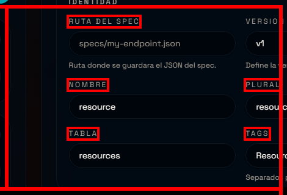
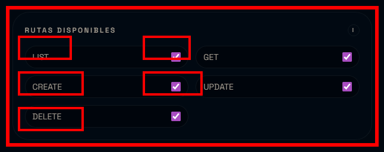
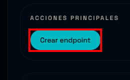
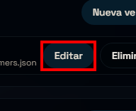
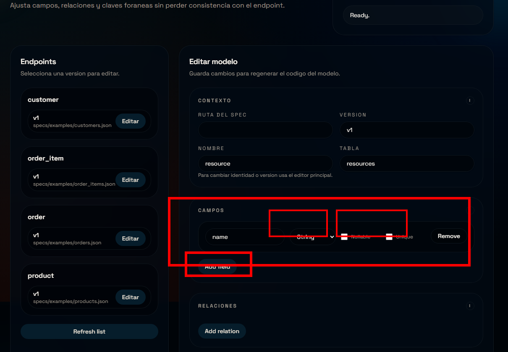
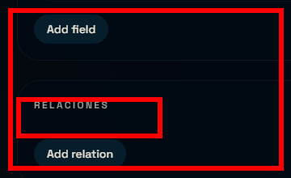
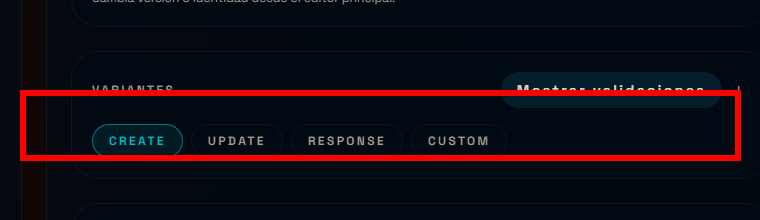
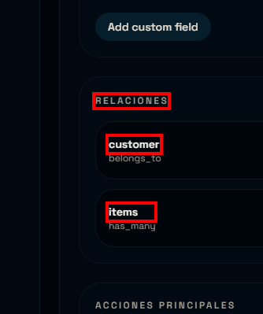
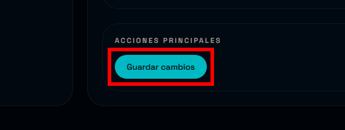

# Tutorial UI (avanzado): customers, products, orders, order_items

Este tutorial crea un circuito completo con relaciones usando solo la UI.
Objetivo: configurar `customers`, `products`, `orders` y `order_items`, con relaciones correctas y schemas embebidos.

## 0) Estructura de datos (resumen)

Relaciones:
- `customers` 1 --- * `orders`
- `orders` 1 --- * `order_items`
- `order_items` * --- 1 `products`

Idea base:
- `belongs_to`: la foreign key vive en este modelo (lado hijo).
- `has_many`: la foreign key vive en el modelo hijo.

## 1) Crear los cuatro endpoints base

En la pantalla principal, crea estos endpoints (igual que en el tutorial basico).


Completa la seccion de identidad y rutas para cada endpoint.





Luego usa "Crear endpoint" para cada uno.



### Customers
- Spec: `specs/examples/customers.json`
- Nombre: `customer`
- Plural: `customers`
- Tabla: `customers`
- Campos:
  - `name` (String, no nullable)
  - `email` (String, no nullable, unique)
  - `phone` (String, nullable)

### Products
- Spec: `specs/examples/products.json`
- Nombre: `product`
- Plural: `products`
- Tabla: `products`
- Campos:
  - `name` (String, no nullable)
  - `sku` (String, no nullable, unique)
  - `price` (Float, no nullable)

### Orders
- Spec: `specs/examples/orders.json`
- Nombre: `order`
- Plural: `orders`
- Tabla: `orders`
- Campos:
  - `order_number` (String, no nullable, unique)
  - `status` (String, no nullable)
  - `total` (Float, no nullable)

### Order items
- Spec: `specs/examples/order_items.json`
- Nombre: `order_item`
- Plural: `order_items`
- Tabla: `order_items`
- Campos:
  - `quantity` (Integer, no nullable)
  - `unit_price` (Float, no nullable)

Nota: los campos se agregan en el Model Editor de cada endpoint.

Luego pulsa "Guardar cambios" en cada endpoint.

## 2) Configurar relaciones en el Model Editor

Abre "Editar endpoint" para `orders` y entra a "Editar modelos".



Usa el icono de base de datos para abrir el Model Editor.


El Model Editor define columnas y relaciones en la base de datos.

En la seccion "Relaciones", crea:

Opciones de campos (resumen):
- Tipo: define el tipo real de la columna en la base.
- Nullable: permite o no valores nulos.
- Unique: agrega una restriccion unica en la tabla.
- Remove: elimina el campo del modelo.

Tipos comunes:
- String: nombres, descripciones, codigos.
- Integer: cantidades y contadores.
- Float: precios o montos.
- Boolean: flags (true/false).
- DateTime: fechas y timestamps.



### Orders -> Customers (belongs_to)
- Tipo: `belongs_to`
- Target: `customers`
- Foreign key: `customer_id`
- Back populates: `orders`
- On delete: `restrict`
- Soft delete cascade: desactivado

Que significa cada campo:
- `Foreign key`: columna real en la tabla hija (aqui: `orders.customer_id`).
- `Back populates`: nombre del atributo relacionado en el otro modelo.
- `On delete`: comportamiento al borrar el padre (DB).
- `Soft delete cascade`: comportamiento de borrado logico.

### Orders -> OrderItems (has_many)
- Tipo: `has_many`
- Target: `order_items`
- Back populates: `order`
- On delete: (vacio o default)
- Soft delete cascade: activado

Por que:
- `orders` depende de `customers`, por eso usamos `restrict` al borrar un customer.
- `order_items` depende de `orders`, por eso permitimos cascada.

Guarda cambios.

Ahora abre el Model Editor para `order_items` y crea:

### OrderItems -> Orders (belongs_to)
- Tipo: `belongs_to`
- Target: `orders`
- Foreign key: `order_id`
- Back populates: `items`
- On delete: `cascade`

### OrderItems -> Products (belongs_to)
- Tipo: `belongs_to`
- Target: `products`
- Foreign key: `product_id`
- Back populates: `order_items`
- On delete: `restrict`

Guarda cambios.

Para `customers` y `products` agrega relaciones inversas:

### Customers -> Orders (has_many)
- Tipo: `has_many`
- Target: `orders`
- Back populates: `customer`

### Products -> OrderItems (has_many)
- Tipo: `has_many`
- Target: `order_items`
- Back populates: `product`

Guarda cambios.

Tip:
- `Foreign key` es el nombre de la columna en la tabla hija.
- `Back populates` debe coincidir en ambos modelos.
- Si no ves la columna (por ejemplo `customer_id`), agregala como campo en el Model Editor.



Cuando termines, pulsa "Guardar cambios" en el Model Editor.


## 3) Configurar schemas en el Schema Editor

Abre el Schema Editor para `orders`.

Desde "Editar endpoint", usa el icono de documento para abrir el Schema Editor.


El Schema Editor define validaciones de entrada y el formato de respuesta.

Define las variantes con estas pestanas:



En "Relations" define:
- `create`: `items` como `Embedded`
- `update`: `items` como `Embedded`
- `response`: `items` como `Embedded` y `customer` como `Embedded`

Opciones de campos en schemas:
- Tipo: valida el dato que llega.
- Required: el campo debe estar presente.
- Enabled: si esta apagado, el campo no se usa en esa variante.
- Default: valor por defecto si no llega en el payload.
- Description: aparece en Swagger.
- Example: ejemplo mostrado en Swagger.


Regla rapida:
- `Embedded` envia y recibe objetos completos.
- `IDs` solo usa identificadores (mas liviano).
- `Omit` excluye la relacion en esa variante.


Esto permite:
- Crear un order con items embebidos.
- Actualizar un order agregando items.
- Devolver en response el customer y los items.



Guarda cambios.



## 4) Verificacion rapida en UI

Revisa que:
- Los cuatro endpoints esten habilitados.
- Las rutas `list/get/create/update/delete` esten activas.
- La UI muestre "Spec loaded" y "Ready" en API status.

## 5) Sync avanzado (opcional)

En la pantalla principal:
- `Sync spec -> codigo`: vuelve a generar codigo desde el spec.
- `Sync codigo -> spec`: analiza codigo y actualiza el spec.

Usalo con cuidado si editaste archivos manualmente.

## 6) Validacion E2E (opcional)

Si quieres probar todo el flujo con una sola ejecucion:
```
python scripts/e2e_orders.py
```

Este script:
- Loguea como admin.
- Crea customer y product.
- Crea order con items embebidos.
- Actualiza order agregando mas items.

## 7) Checklist de fallas comunes

- `Back populates` no coincide entre modelos.
- `Foreign key` no coincide con el nombre en la tabla hija.
- `orders` no tiene `customer_id`.
- `order_items` no tiene `order_id` o `product_id`.
- No se guardaron los cambios en Model/Schema editor.

Si sigues estos pasos, el circuito completo queda consistente y listo para usar.
