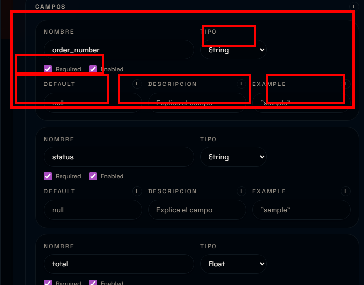
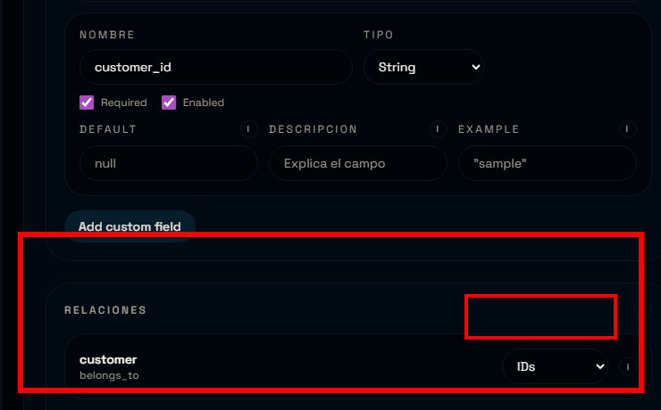

# Tutorial UI (sin codigo): crear un endpoint simple

Este tutorial es el equivalente UI del flujo manual. No vas a escribir codigo: todo se configura desde la interfaz y el template genera el resto.

Objetivo: crear un endpoint `categories` con `name` y `description`.

## 0) Estado de la UI

Antes de empezar, confirma:
- "API Status" dice "Ready".
- No hay indicador "Compiling..." en pantalla. Si aparece, espera a que termine antes de continuar.

## 1) Crear un endpoint nuevo

Pulsa "Nuevo endpoint".

## 2) Completar identidad del endpoint

La seccion "Identidad" define como se llama el recurso y donde se guarda su spec. En la imagen se resaltan los campos clave.

Que significa cada campo:
- Ruta del spec: archivo JSON donde vive la definicion (ej: `specs/examples/categories.json`).
- Version: prefijo de ruta (`v1`). Esto define el path final: `/v1/categories`.
- Nombre: singular (`category`). Se usa en nombres internos y modelos.
- Plural: plural y ruta base (`categories`). Se usa en el path y el router.
- Tabla: nombre real en la base (`categories`). Se usa para crear la tabla.
- Tags: grupo en Swagger (`Categories`). Organiza los endpoints en la UI de docs.

Valores sugeridos:
- Ruta del spec: `specs/examples/categories.json`
- Version: `v1`
- Nombre: `category`
- Plural: `categories`
- Tabla: `categories`
- Tags: `Categories`

Tip: evita espacios en la ruta del spec y usa nombres consistentes (plural y tabla en minuscula).

## 3) Seguridad y comportamiento

Estos toggles definen el comportamiento general del endpoint.

Recomendado para un endpoint simple:
- Auth required: activado
- Soft delete: activado
- Pagination / Ordering: activado
- Tests enabled: activado

Nota rapida:
- Soft delete evita borrados fisicos.
- Pagination/Ordering agregan query params en los listados.
- Tests enabled genera tests base para el recurso.

## 4) Rutas disponibles

Activa las rutas que quieres exponer en la API. En la imagen se resaltan las rutas del CRUD.

Para un CRUD completo:
- LIST, GET, CREATE, UPDATE, DELETE

## 5) Crear el endpoint

Pulsa "Crear endpoint". Esto genera el spec, el modelo, el schema, el router y la logica.

Si no aparece en la lista, pulsa "Refresh list".

Se generan estos archivos (nombres aproximados):
- Spec en `specs/examples/categories.json`
- Modelo en `app/database/models/categories_models.py`
- Schemas en `app/schemas/categories_schemas.py`
- Router en `app/routers/v1/categories.py`
- Logica en `app/endpoints_logic/v1/categories.py`

## 6) Entrar a edicion del endpoint

En la lista, usa "Editar" para abrir el editor del endpoint.

## 7) Editar modelos y definir campos

Desde la barra del editor, abre el Model Editor. El icono con forma de base de datos abre modelos, el icono de llaves abre schemas.

En el Model Editor agrega los campos:
- `name`: String, Nullable false, Unique true.
- `description`: String, Nullable true, Unique false.

En la imagen se resalta el boton "Add field".

Opciones de cada campo (que significan):
- Tipo: define el tipo real de la columna en la base (String/Integer/Float/Boolean/DateTime).
- Nullable: permite o no valores nulos.
- Unique: agrega una restriccion unica en la tabla.
- Remove: elimina el campo del modelo.

Como elegir los tipos (ejemplos rapidos):
- String: nombres, descripciones, codigos.
- Integer: cantidades y contadores.
- Float: precios o montos.
- Boolean: flags (true/false).
- DateTime: fechas y timestamps.

Cuando termines, pulsa "Guardar cambios" en el Model Editor.

## 8) Editar schemas y validaciones

Abre el Schema Editor. Usa las pestanas CREATE/UPDATE/RESPONSE para ajustar:
- Campos requeridos en create.
- Campos opcionales en update.
- Campos que se devuelven en response.

En la imagen se resaltan las pestanas de variantes.

Opciones de cada campo en schemas:
- Tipo: valida el dato que llega (mismos tipos base).
- Required: el campo debe estar presente.
- Enabled: si esta apagado, el campo no se usa en esa variante.
- Default: valor por defecto si no llega en el payload.
- Description: aparece en Swagger.
- Example: ejemplo mostrado en Swagger.

Relaciones en schemas:
- Sirven para definir como viajan las relaciones en la API.
- Embedded: envia objetos completos.
- IDs: envia solo identificadores (payload mas liviano).
- Omit: no incluye la relacion en esa variante.

Cuando termines, pulsa "Guardar cambios" en el Schema Editor.

Idea base de las variantes:
- CREATE valida el body de creacion.
- UPDATE valida el body de actualizacion.
- RESPONSE define que campos se devuelven en la API.

## 9) Checklist rapido (errores comunes)

- Nombre/Plural/Tabla no coinciden.
- Auth required activo pero `AUTH_MODE=disabled` en `.env`.
- Se olvidaron de guardar cambios en Model/Schema editor.
- La app estaba en "Compiling..." y el spec no se aplico.

Con esto ya puedes crear endpoints simples desde la UI sin tocar codigo.
