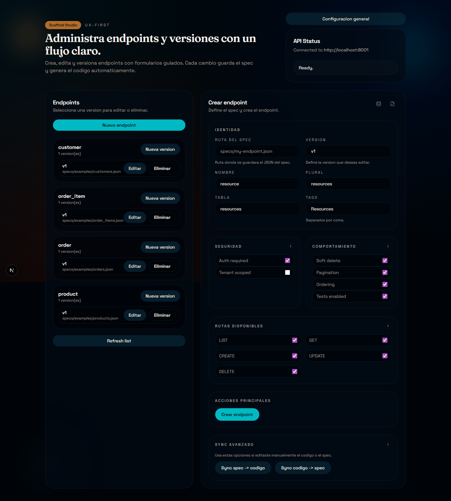
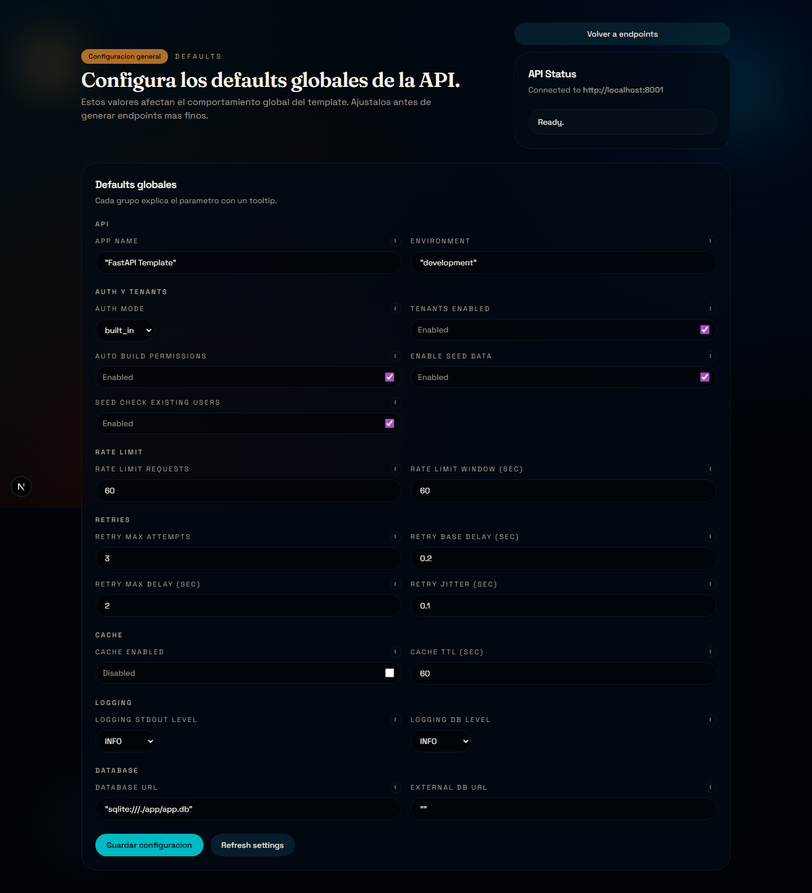
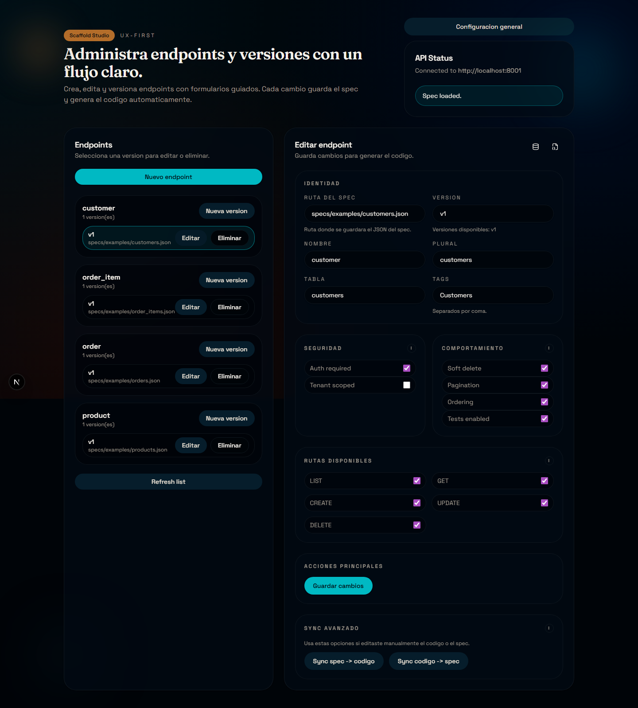
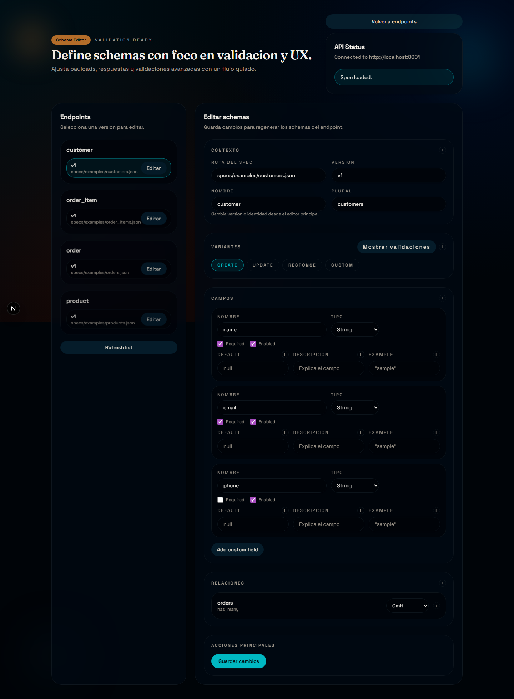

# Tutorial UI (sin codigo): crear un endpoint simple

Este tutorial es el equivalente UI del flujo manual. No vas a escribir codigo: todo se configura desde la interfaz y el template genera el resto.

Objetivo: crear un endpoint `categories` con `name` y `description`.

## 0) Abrir la UI y ubicar las secciones

Entra a la UI y confirma que ves:
- Listado de endpoints (izquierda).
- Formulario de creacion/edicion (centro-derecha).
- Estado de la API (arriba derecha).

## 1) Opcional: configurar defaults globales

Si quieres que los nuevos endpoints hereden defaults (auth, rate limit, cache, etc), entra a "Configuracion general".

Notas rapidas:
- `Auth mode` controla si los endpoints con auth se cargan o no.
- `Auto build permissions` crea permisos al iniciar la app.
- `Tenants enabled` activa o desactiva el scope por tenant.

Vuelve a la pantalla principal con "Volver a endpoints".

## 2) Crear un endpoint nuevo

Pulsa "Nuevo endpoint". Veras el formulario "Crear endpoint".

Campos de identidad (que significan):
- `Ruta del spec`: archivo donde se guarda el JSON del spec. Recomendado: `specs/examples/categories.json`.
- `Version`: prefijo de ruta (ej: `v1`).
- `Nombre`: singular del recurso (`category`).
- `Plural`: plural del recurso (`categories`).
- `Tabla`: nombre real de la tabla (`categories`).
- `Tags`: grupo en Swagger (`Categories`).

Ejemplo de valores:
- Ruta del spec: `specs/examples/categories.json`
- Version: `v1`
- Nombre: `category`
- Plural: `categories`
- Tabla: `categories`
- Tags: `Categories`

## 3) Definir los campos del modelo

En la seccion "Campos":
- `name`: tipo `String`, `Nullable` desactivado, `Unique` activado.
- `description`: tipo `String`, `Nullable` activado, `Unique` desactivado.

Conceptos:
- `Nullable`: permite guardar null en la base de datos.
- `Unique`: obliga a que no se repita el valor.
- `Tipo`: tipo SQLAlchemy base (String, Integer, Float, Boolean, DateTime, etc).

## 4) Seguridad, comportamiento y rutas

Selecciona:
- `Auth required`: activado si quieres proteger con login.
- `Tenant scoped`: solo si tu app usa tenants.
- `Soft delete`: activado para borrado logico.
- `Pagination` y `Ordering`: activados para listados.
- `Tests enabled`: activado si quieres tests generados.

En "Rutas disponibles":
- Activa `LIST`, `GET`, `CREATE`, `UPDATE`, `DELETE`.

## 5) Crear el endpoint

Pulsa "Crear endpoint".

Que pasa internamente:
- Se crea el spec JSON en la ruta indicada.
- Se generan modelo, schema, logica y router.
- Se agrega el router a `registry_data.json`.
- Se generan tests si esta activado.

Tip: si no ves el endpoint en la lista, usa "Refresh list".

## 6) Editar un endpoint existente

En la lista, pulsa "Editar" sobre el endpoint creado. Veras el formulario de edicion.

Cambios comunes:
- Ajustar `Tags`.
- Habilitar/Deshabilitar endpoints en "Rutas disponibles".
- Cambiar defaults de seguridad.

Pulsa "Guardar cambios" para regenerar el codigo.

## 7) Ir a modelos o schemas desde la UI

En la barra de "Editar endpoint" veras dos iconos:
- "Editar modelos"
- "Editar schemas"

Esos accesos abren pantallas separadas.

Schemas:

Models:

## 8) Checklist rapido (errores comunes)

- `Nombre`, `Plural` y `Tabla` no coinciden (rompe rutas o DB).
- `Auth required` activo pero `AUTH_MODE=disabled` en `.env`.
- No refrescaste la lista despues de crear.
- Cambiaste campos sin "Guardar cambios".

Con esto ya puedes crear endpoints simples desde la UI sin tocar codigo.
